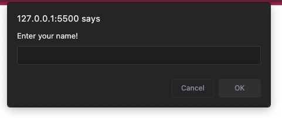
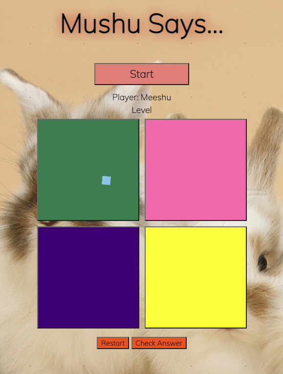
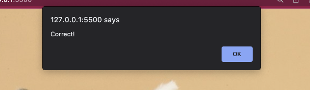
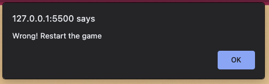
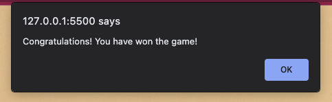

Game Title: "Mushu Says..."

Description: A modern spin on an old classic, Mushu Says... is the updated version of the ever so popular Simon Says...

Players will select the correct square in the correct order of the pattern flashed. The goal is to reach level 10! Let's see how well you fare in this game. 

Enter your name to play:

Game:

Correct choice:

Incorrect choice:

Winner:

Languages used to create game: HTML, CSS, and Javascript

Game link: 

Future Steps:
1. Add modal animations after each level
2. Make the game increasingly difficult
3. Add more squares
4. Increase the pattern length each round
5. Add a score board

